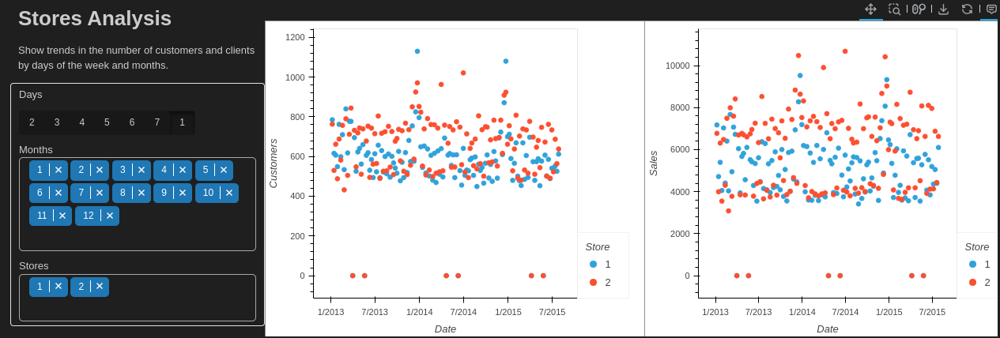

# Data-Science-Applied-Business-6-Real-Case-Studies

## Human Resources

## Marketing

Summary:

* In this study, you have been hired as a for a bank in New York.
* The bank have extent dataset about their clients since six month.
* The bank's marketing team wants to launch an advertising marketing campaign targeting its customers in a maximum of three different groups.

Algorithms:

* K-means
* PCA
* Autoencoders

From K-means and PCA:

From encoder, K-means, and PCA:

## Sales

Summary:

* In this project, you act as a data scientist in the sales department, and the sales team provides you with data from over 1,115 stores.
* The objective is to predict the daily sales for the future, in function of the characteristics.

Algorithms:

* Facebook Prophet

Stores Analysis Dashboard:

Overview Analysis Dashboard:

Predictions:

## Operations

## Public relations

## Production, manufacturing and maintenance
