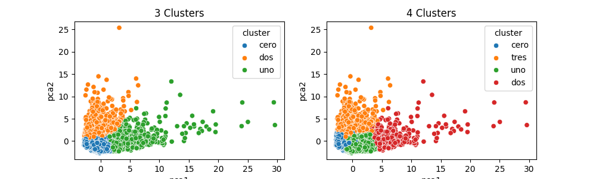

# Data-Science-Applied-Business-6-Real-Case-Studies

## Human Resources

## Marketing

Rummary:

* In this study, you have been hired as a for a bank in New York.
* The bank have extent dataset about their clients since six month.
* The bank's marketing team wants to launch an advertising marketing campaign targeting its customers in a maximum of three different groups.

Algoritmos usados:

* K-means
* PCA
* Autoencoders

Result:

From encoder:

## Sales

## Operations

## Public relations

## Production, manufacturing and maintenance
